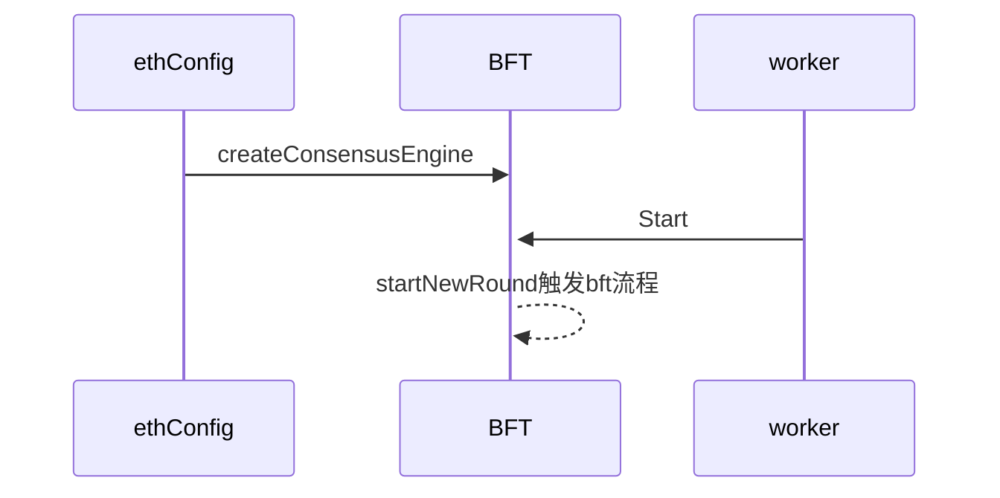

# 以太坊BFT改造计划
## 概念
1、Epoch：保存块高和对应validator的一个集合。

2、View：Round和Sequence（块高）的集合。

3、ExtraData：以太坊区块模型中的字段，原先主要用来记录分叉信息，在bft中可以用来记录共识信息。

4、Proposal：一个区块提案。

5、proposer：矿工。

6、QC: 表示一个被(n−f)个节点签名确认的数据包及viewNumber。比如，对某个区块的(n−f)个投票集合。

## 前提
以太坊改造共识算法后出块流程就发生改变，针对出块流程改造目前有两种思路：
* 1、一种是通过在新的BFT算法流程中重新去出块；
* 2、利用原先的work.go调用的mainLoop让节点不停挖矿，在算法选出proposer后，proposer节点去resultLoop里面提交区块。注意：这种情况下即使是非矿工节点，也会不停地挖矿，只是在共识算法的Seal接口中不会commit到resultLoop。
  * commitNewWork挖矿程序中需要检查是否EpochChange（validator改变，可通过以太坊的feed事件模块来实现相关功能），因为每个epochChange影响到下一轮的bft校验。
  * 预先构建ExtraData的格式，后续共识过程中填补。
  * 如果后续需要分叉，也需要在commitNewWork中修改。
    

本文讨论的方式是针对第2中简易版本；

## 流程

* 修改共识引擎流程：
  * 扩展chainConfig，根据chainConfig的不同，ethConfig创建不同的共识引擎




* BFT矿工挖矿流程

  ```mermaid
  sequenceDiagram
      newWorkLoop ->> mainLoop : 通过worker.newWorkCh发送任务
      mainLoop ->> mainLoop : commitNewWork组装区块
      mainLoop ->> + taskLoop : 通过worker.taskCh发送任务到taskLoop
      taskLoop ->> BFT Engine : 传递区块给BFT引擎，BFT通过Seal接口封装区块
      BFT Engine -->> BFT Engine : EventMux().Post(bft.RequestEvent）把区块给到自己
      BFT Engine -->> BFT Engine : handler处理本地区块，存储到共识引擎的区块队列中
      BFT Engine -->> BFT Engine : 如果轮到自己出块就把去区块队列中取出最早的区块，传播给网络中其它节点，经过节点之间BFT流程，最后commit的时候通过把block写入commitCh
      BFT Engine ->> resultLoop : 通过commitCh把区块信息写入resultCh的方式发送提交存储区块请求
  ```

* BFT 共识算法流程设计（**代码**参考了以太社区版本的Istanbul BFT，**流程**上参考了HotStuff而没有采用HotStuff的bls签名，可以视为**初级版本**的hotstuff）

  * 本BFT参考了Hotstuff共识算法的流程，包括三个阶段：`PREPARE`、```PRECOMMIT```以及`COMMIT`。在`N`个节点的网络中，这个算法可以最多容忍`F`个出错节点，其中`N=3F+1`。

  * 每一轮共识开始，bft引擎会自动根据上一个proposal（当前最高块）以及```Epoch```信息选取新的一轮的```proposer```。
  * 每一个```validator```会组织一个```NewView```，其中包含了```prepareQC```（为**最新区块被commit之后保存的一些投票状态**），并**单一发送**给```proposer```（consensus/bft/core/new_view.go; consensus/bft/backend/backend.go），网络中的节点可以根据```prepareQC```（因为是按最新块组装的，所以视为```highQC```）和签名信息校验区块，通过后发送```PrepareVote```给本次```view```的```proposer```。
  * ```proposer```收到```2f+1```个```newView```信息后，会**广播**```prepare```信息给其它```validator```。
  * ```validator```收到```prepare```信息后，会校验```proposal```，校验通过后发**单一发送**```prepareVote```给```proposer```。
  * ```proposer```收到```2f+1```个```prepareVote```后，会**广播**```prepareCommit```给其它```validator```。
  * ```validator```收到```prepareCommit```信息后，会校验```proposal```，校验通过后会**单一发送**```prepareCommitVote```给```validator```。
  * ```proposer```收到```2f+1```个```prepareCommitVote```后，会**广播**```commit```给其它```validator```。
  * ```validator```收到```commit```信息后，会校验```proposal```，校验通过后会**单一发送**commitVote```给```validator```。
  * ```proposer```收到```2f+1```个```commitVote```后，会把区块插入本地节点，并**广播**```deide```给其它```validator```。
  * ```validator```收到```deide```信息后，会校验```proposal```，校验通过后会把区块插入本地节点。
  * ```startNewRound```每个节点在插入区块或者本round超时后，开始下一轮出块。

## 共识状态（consensus/bft/core/types.go）

- ```NewView```: validator发送prepareQC给proposer。

- ```Prepare```: proposer收到2f+1个newView后，会校验并组织highQC，并**广播**prepare（包含了highQC）信息给其它validator。

- ```PrepareVote```: validator收到prepare信息后，会根据一定的规则校验proposal，校验通过后发送给proposerVote给proposer。校验规则如下：

  * Proposal是由lockQC的区块扩展产生（即m.block是lockQC.block的子孙区块）
  * 为了保证liveness, 除了上一条之外，当Proposal.highQC高于本地lockQC中的view_number时也会接收该proposal。

- ```PreCommit```: proposer需要对2f+1个prepareVote进行校验，校验通过后（细节略）生成新的prepareQC（**注意：**此时的prepareQC和newView时的不一样。为当前进行中区块的信息），并广播preCommit给其它validator。

- ```PreCommitVote```: validator接收到preCommit之后，校验新的proposal（细节略），并签名发送给proposer。

- ```Commit```:proposer接受到2f+1个preCommitVote之后，校验并签名，广播给validator。

- ```CommitVote```:validator校验信息，签名，发送给proposer；校验信息如下：

  * view

  * proposer

  * prepareQC的hash
  * proposal本身

- ```Decide```:proposer校验2f+1个commitVote（细节略），发送decide给validator。validator接收到decide后会调用handleFinalCommitted插入本地节点。

- ```startNewRound```：开始新的一轮

  

# 代码设计

### 基础共识接口（扩展consensus/consensus.go中的接口）

```
BFT共识算法需要实现原本以太坊的固有共识算法接口（consensus/consensus.go中定义的），并在此基础上扩展部分接口。以下表格
```

|接口名|接口功能|                  备注                  |
|:---:|:---:|:---:|
|   Engine    |共识引擎接口，包含了区块头校验等功能，出块过程和数据同步过程都用到|               以太坊自带               |
|     BFT     |BFT启停校验等核心功能；扩展了Engine接口|添加Start、Stop、ChangeEpoch功能|
|ChainReader|以太坊自带获取链上区块信息|以太坊自带|
|Broadcaster|定义bft流程中的获取peer以及区块排序接口|eth/handler.go需要实现这些接口|
|Peer|封装p2p的Send接口|Send(msgcode uint64, data interface{})|
|Handler|处理peer、区块信息的接口||


### 添加bft模块

在consensus目录下新建bft模块：核心模块主要包含以下内容
1、backend模块：

* engine.go：主要实现以太坊的共识算法接口，包含了区块头验证，区块准备，以及blockFinalization等操作（具体可参考黄皮书），并且负责新的bft共识引擎的启动停止等工作；
* backend：处理bft（hotstuff）不同阶段的通信功能；
* epoch: 以太坊的区块中的ExtraData字段可以活用来存储bft的validator签名信息，此模块可以用来解析区块头中的extraData信息，并把相应信息存储Epoch中，epoch信息包含了改变后的validator集合以及生效区域块高度；
* handler: p2p接收到的信息进行处理，通过事件机制在本节点内部进行信息处理。

2、core模块：

* backlog.go: 用来定义节点共识过程中的通信信息，例如：1、未来区块，2、超时等，3、NewView，4、prepare，5、preCommit，6、commit等；
* handler.go: 负责上述文件中定义信息的处理，例如如果超时，会对本节点发送startNewRound操作；
* prepare: 对应hotstuff中的pre-prepare阶段；
* preCommit: 对应hotstuff中的相应阶段；
* commit:对应hotstuff中的相应阶段；
* decide: hotstuff，处理FinalCommitted的区块，把区块插入本地节点，并且启动startNewRound；
* newView: startNewRound（包含了新的区块高度和round信息）需要启动的操作，会通过gossip协议广播给所有的validator
* utils: 通信协议，封装过后的gossip广播等功能。

3、 validator模块：
* validator.go: 辅助功能，用来解析本地节点拿到的区块（prepare之后）中保存的validator签名信息。

4、signer模块：
* signer.go: 检查节点之间的QC信息，包含了各个proposer传递过来的区块头信息，以及签名是否达到quorum值，也就是超过2/3的总节点数。

